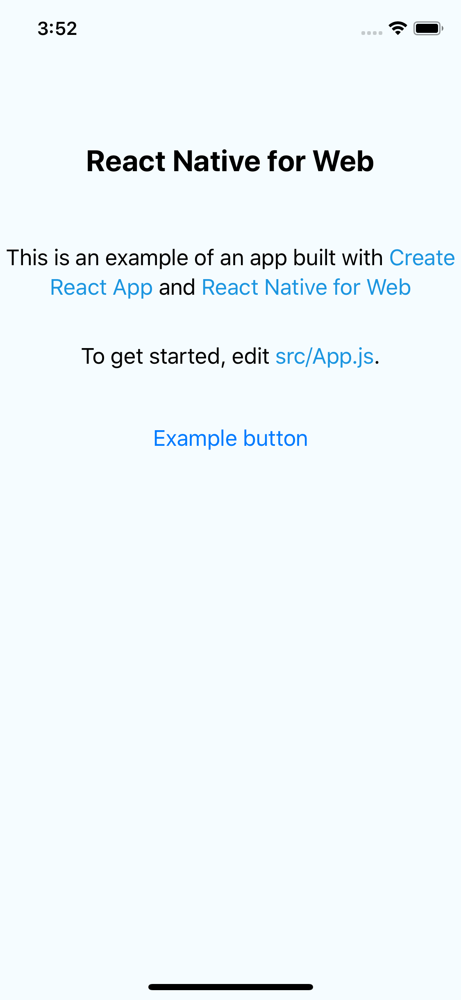
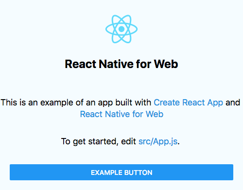

# Setting up CrossPlatform React Native Web and ReasonML

## Uses Create-React-App and React-Native-cli

1. `npx create-react-app --scripts-version=react-scripts-for-react-native-web my-app` using this [create-react-app fork](https://github.com/amsb/create-react-app-for-react-native-web)
2. `touch bsconfig.json`
3. `yarn add -D bs-platform`
4. `yarn add reason-react bs-react-native react-native-web`
5. `echo "SKIP_PREFLIGHT_CHECK=true" > .env`.
6. Open `bsconfig.json`, add the following:

```json
{
  "name": "my-app",
  "version": "0.1.0",
  "reason": {
    "react-jsx": 2
  },
  "package-specs": {
    "module": "commonjs",
    "in-source": true
  },
  "bsc-flags": [
    "-bs-super-errors"
  ],
  "sources": [
    {
      "dir": "src",
      "subdirs": true
    }
  ],
  "bs-dependencies": ["reason-react", "bs-react-native"],
  "refmt": 3,
  "suffix": ".bs.js",
  "namespace": true
}
```

## ReactNative

1. In a seperate directory run `react-native init RnMyApp --template reason`
2. Copy all of the root directory files/dir except `node_modules` and `App.js` into the web app you created before.
3. Rename `index.js` in your root directory to `index.ios.js`. Then open it and change `import App from 'App';` to `import {default as App} from 'src/App.bs';`
4. Change your first scripts to they look like:

```json
"start": "node node_modules/react-native/local-cli/cli.js start",
"ios": "react-native run-ios",
"start:web": "react-scripts start",
"build-reason": "bsb -make-world",
"watch": "bsb -make-world -w",
"clean": "bsb -clean-world"
```

## Running Each Project

1. Compile reason with `yarn watch`
2. Run web version with `yarn start-web`
3. Run `yarn start` to run start react-native.
4. Run `yarn ios` to run the simulator. This takes a while.


